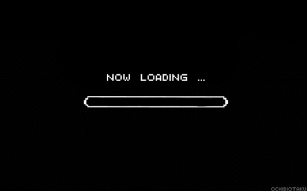

# s6-reprograma-API-Node

Introdução aos conceitos de API e Node, com alguma atividade simples introdutória desenvolvida na semana 6 do curso Desenvolvedora Backend pela Reprograma.

 

 

------
Neste repositório você encontrará um  outro 'Readme' com outro nome (*respostasReadme*), que conterá as respostas das perguntas feitas no repositório '*forkardo*' de nome **On16-TodasEmTech-S6-Intro-API-Node**.
